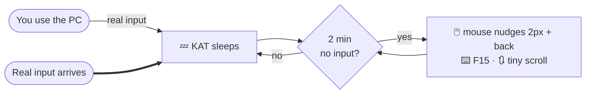

# 🐱 KAT
### **K**eep **A**wake **T**ool · *a study artifact*

*A case study of how Windows detects idle time — and how discreetly one could
counteract it.*

 

---

> [!CAUTION]
> ### 🔬 For research and demonstration purposes only
>
> This repository is a **learning and research project** about Windows idle
> detection (`GetLastInputInfo`), low-level input hooks (`WH_MOUSE_LL` /
> `WH_KEYBOARD_LL`) and synthetic input (`SendInput`) — entirely in the Python
> standard library (ctypes).
>
> **It is NOT intended for personal use and should NOT be used** — neither
> privately nor at work. Circumventing presence, lock or availability mechanisms
> may violate employment, usage or IT policies. Use is entirely at your **own
> risk**; **no warranty and no liability** whatsoever.

---

## 🧩 What is this?

A Windows PC goes to lock / idle after a short period of inactivity. KAT
demonstrates how a program *detects* that inactivity and would respond to it with
**minimal, harmless** input — no window, no traces, controlled only through a
small tray icon.

## 🧠 How it works

- **While you use the PC, nothing happens.** Low-level hooks detect *real* input;
  the program's own synthetic events are filtered out via the `INJECTED` flag.
- **Only after the idle time** (default **2 minutes**) does it nudge the mouse a
  few pixels and **move it back exactly**, occasionally tap the harmless **F15**
  key and scroll minimally. It **cannot click or change anything**.
- **As soon as real input arrives, it pauses immediately** and waits for the idle
  time again.
- **No logging, no messages, no internet connection.** Runs entirely locally.

## 📦 Contents

After downloading you get **exactly two things**:

| Item | Meaning |
| :-- | :-- |
| 📁 **`DO NOT OPEN`** | Contains the actual program. The name says it all — **just leave it alone.** |
| ▶️ **`install.bat`** | The installer. One double-click sets everything up. |

> [!NOTE]
> You do **not** need to open the folder or understand anything inside it —
> `install.bat` does everything. Afterwards only an inconspicuous shortcut remains
> on the desktop.

## 🚀 Installation (for testing / research)

1. Click **`Code` → `Download ZIP`** (or `git clone`).
2. **Fully extract** the ZIP (do not run it from the ZIP preview!).
3. Double-click **`install.bat`** in the extracted folder.

<b>What the installer does exactly</b>

 

- sets up Python if it is missing (via `winget`),
- copies the program into a **hidden** folder in your user profile
  (`%USERPROFILE%\.tracehost`),
- creates a **disguised** desktop shortcut named **`tracertStray`**
  (inconspicuous gear icon),
- starts the program,
- and **cleans up the downloaded folder afterwards** (if anything is left over:
  just delete it yourself — only the desktop shortcut is needed).

## 🎛️ Usage

Small icon at the bottom right, possibly under the arrow **˄** ("hidden icons").
**Right-click:**

| Menu item | Function |
| :-- | :-- |
| **Test now** | runs one action immediately (check) |
| **Show status** | current state |
| **Pause / Resume** | manual on/off |
| **Quit** | close the program |

## ⚙️ Configuration

At the top of `kat.pyw` (inside the hidden folder):

| Setting | Meaning | Default |
| :-- | :-- | :-- |
| `IDLE_THRESHOLD` | idle time in seconds before it becomes active | `120` |
| `ENABLE_CLICK` | real clicks (may click whatever is under the cursor) | `False` |

## 🧹 Uninstall

1. Tray icon → right-click → **Quit**.
2. Delete the desktop shortcut **`tracertStray`**.
3. Delete the folder **`%USERPROFILE%\.tracehost`** (paste it into the Explorer
   address bar).

## 🖥️ Requirements

Windows 10 / 11. Python is installed automatically if needed. No other packages.

---

### ❓ Support

**If nothing works, please contact Ollio!**

 

For research and demonstration purposes only · not for productive use ·
no warranty, no liability.

