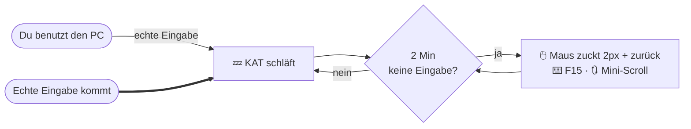

# 🐱 KAT
### **K**eep **A**wake **T**ool · *ein Studien-Artefakt*

*Eine Fallstudie darüber, wie Windows Leerlauf erkennt — und wie unauffällig
man dem entgegenwirken könnte.*

 

---

> [!CAUTION]
> ### 🔬 Ausschließlich zu Forschungs- und Demonstrationszwecken
>
> Dieses Repository ist ein **Lern- und Forschungsprojekt** über Windows-Idle-Erkennung
> (`GetLastInputInfo`), Low-Level-Eingabe-Hooks (`WH_MOUSE_LL` / `WH_KEYBOARD_LL`) und
> synthetische Eingaben (`SendInput`) — komplett in Python-Standardbibliothek (ctypes).
>
> **Es ist NICHT für den Eigengebrauch gedacht und sollte NICHT eingesetzt werden** –
> weder privat noch am Arbeitsplatz. Das Aushebeln von Anwesenheits-, Sperr- oder
> Präsenz-Mechanismen kann gegen Arbeits-, Nutzungs- oder IT-Richtlinien verstoßen.
> Verwendung erfolgt vollständig auf **eigene Verantwortung**; es wird **keinerlei Haftung**
> übernommen.

---

## 🧩 Worum geht es?

Ein Windows-PC springt nach kurzer Untätigkeit in Sperre / Leerlauf. KAT demonstriert,
wie ein Programm diese Untätigkeit *erkennt* und mit **minimalen, folgenlosen** Eingaben
darauf reagieren würde — ohne Fenster, ohne Spuren, gesteuert nur über ein kleines
Tray-Icon.

## 🧠 Wie es funktioniert

- **Solange du den PC benutzt, passiert nichts.** Low-Level-Hooks erkennen *echte*
  Eingaben; die eigenen synthetischen Events werden per `INJECTED`-Flag herausgefiltert.
- **Erst nach der Leerlaufzeit** (Standard **2 Minuten**) bewegt es die Maus ein paar Pixel
  und **exakt wieder zurück**, tippt gelegentlich die folgenlose **F15**-Taste und scrollt
  minimal. Es kann dadurch **nichts anklicken oder verändern**.
- **Sobald wieder echte Eingabe kommt, pausiert es sofort** und wartet erneut die
  Leerlaufzeit ab.
- **Kein Logging, keine Meldungen, keine Internetverbindung.** Läuft komplett lokal.

## 📦 Inhalt

Nach dem Download findest du **genau zwei Dinge**:

| Element | Bedeutung |
| :-- | :-- |
| 📁 **`NICHT ÖFFNEN`** | Enthält das eigentliche Programm. Der Name ist Programm — **einfach in Ruhe lassen.** |
| ▶️ **`install.bat`** | Der Installer. Ein Doppelklick richtet alles ein. |

> [!NOTE]
> Du musst den Ordner **nicht** öffnen und nichts darin verstehen — `install.bat`
> erledigt alles. Danach bleibt auf dem Desktop nur eine unauffällige Verknüpfung.

## 🚀 Installation (für Test-/Forschungszwecke)

1. Oben **`Code` → `Download ZIP`** (oder `git clone`).
2. ZIP **komplett entpacken** (nicht aus der ZIP-Vorschau starten!).
3. Im entpackten Ordner **`install.bat` doppelklicken**.

<b>Was der Installer genau tut</b>

 

- richtet Python ein, falls nicht vorhanden (per `winget`),
- kopiert das Programm in einen **versteckten** Ordner im Benutzerprofil
  (`%USERPROFILE%\.tracehost`),
- legt eine **getarnte** Desktop-Verknüpfung mit dem Namen **`tracertStray`** an
  (unauffälliges Zahnrad-Icon),
- startet das Programm,
- und **räumt den heruntergeladenen Ordner anschließend auf** (falls etwas übrig bleibt:
  einfach selbst löschen — gebraucht wird nur die Desktop-Verknüpfung).

## 🎛️ Bedienung

Kleines Icon unten rechts, ggf. unter dem Pfeil **˄** („ausgeblendete Symbole").
**Rechtsklick:**

| Menüpunkt | Funktion |
| :-- | :-- |
| **Jetzt testen** | führt sofort eine Aktion aus (Kontrolle) |
| **Status anzeigen** | aktueller Zustand |
| **Pausieren / Fortsetzen** | manuell an/aus |
| **Beenden** | Programm schließen |

## ⚙️ Konfiguration

Oben in `kat.pyw` (im versteckten Ordner):

| Einstellung | Bedeutung | Standard |
| :-- | :-- | :-- |
| `IDLE_THRESHOLD` | Leerlaufzeit in Sekunden, bevor es aktiv wird | `120` |
| `ENABLE_CLICK` | echte Klicks (kann anklicken, was unter dem Cursor liegt) | `False` |

## 🧹 Deinstallation

1. Tray-Icon → Rechtsklick → **Beenden**.
2. Desktop-Verknüpfung **`tracertStray`** löschen.
3. Ordner **`%USERPROFILE%\.tracehost`** löschen (im Explorer in die Adresszeile einfügen).

## 🖥️ Voraussetzungen

Windows 10 / 11. Python wird bei Bedarf automatisch installiert. Keine weiteren Pakete.

---

### ❓ Support

**Wenn nichts klappt, bitte bei Ollio melden!**

 

Nur zu Forschungs- und Demonstrationszwecken · nicht für den produktiven Einsatz ·
keine Gewähr, keine Haftung.

